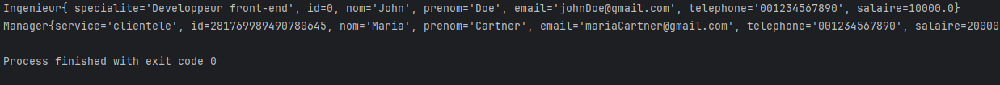

# Classe Employe

## Français

La classe `Employe` est une classe abstraite qui représente un employé avec des attributs communs tels que le nom, le prénom, l'email, le téléphone et le salaire. Cette classe sert de base pour d'autres classes d'employés qui fourniront une implémentation spécifique pour le calcul du salaire.

### Attributs
- `id` (long) : Identifiant unique généré automatiquement pour l'employé.
- `nom` (String) : Nom de l'employé.
- `prenom` (String) : Prénom de l'employé.
- `email` (String) : Adresse email de l'employé.
- `telephone` (String) : Numéro de téléphone de l'employé.
- `salaire` (double) : Salaire de l'employé.

### Constructeurs
- `Employe()` : Constructeur par défaut.
- `Employe(String nom, String prenom, String email, String telephone, double salaire)` : Crée une nouvelle instance d'`Employe` en initialisant les attributs avec les valeurs fournies et en générant un identifiant unique.

### Méthodes
- `abstract double calculerSalaire()` : Méthode abstraite à implémenter dans les sous-classes pour calculer le salaire de l'employé.

---

## English

The `Employe` class is an abstract class that represents an employee with common attributes such as name, surname, email, phone number, and salary. This class serves as a base for other employee classes that will provide a specific implementation for salary calculation.

### Attributes
- `id` (long): Automatically generated unique identifier for the employee.
- `nom` (String): Employee's last name.
- `prenom` (String): Employee's first name.
- `email` (String): Employee's email address.
- `telephone` (String): Employee's phone number.
- `salaire` (double): Employee's salary.

### Constructors
- `Employe()`: Default constructor.
- `Employe(String nom, String prenom, String email, String telephone, double salaire)`: Creates a new `Employe` instance, initializing the attributes with the provided values and generating a unique identifier.

### Methods
- `abstract double calculerSalaire()`: Abstract method to be implemented in subclasses to calculate the employee's salary.

# Classe Ingenieur

## Français

La classe `Ingenieur` hérite de la classe `Employe` et représente un ingénieur avec une spécialité. Elle fournit une implémentation pour le calcul du salaire de l'ingénieur en appliquant un coefficient sur le salaire de base.

### Attributs
- `id` (long) : Identifiant unique de l'ingénieur (hérité de la classe `Employe`, mais non utilisé).
- `specialite` (String) : Spécialité de l'ingénieur.

### Constructeurs
- `Ingenieur(String nom, String prenom, String email, String telephone, double salaire, String specialite)` : Crée une nouvelle instance d'`Ingenieur` en initialisant les attributs de la classe `Employe` ainsi que la spécialité.

### Méthodes
- `double calculerSalaire()` : Calcule et retourne le salaire de l'ingénieur en appliquant un coefficient de 1.15 au salaire de base.
- `String toString()` : Retourne une représentation sous forme de chaîne de caractères de l'ingénieur, incluant tous ses attributs.

---

## English

The `Ingenieur` class inherits from the `Employe` class and represents an engineer with a specialty. It provides an implementation for calculating the engineer's salary by applying a coefficient to the base salary.

### Attributes
- `id` (long): Unique identifier for the engineer (inherited from the `Employe` class but not used).
- `specialite` (String): Specialty of the engineer.

### Constructors
- `Ingenieur(String nom, String prenom, String email, String telephone, double salaire, String specialite)`: Creates a new `Ingenieur` instance, initializing the attributes of the `Employe` class and the specialty.

### Methods
- `double calculerSalaire()`: Calculates and returns the engineer's salary by applying a coefficient of 1.15 to the base salary.
- `String toString()`: Returns a string representation of the engineer, including all its attributes.

# Classe Manager

## Français

La classe `Manager` hérite de la classe `Employe` et représente un manager qui supervise un service spécifique. Elle fournit une implémentation pour le calcul du salaire du manager en appliquant un coefficient supérieur au salaire de base.

### Attributs
- `service` (String) : Le service sous la responsabilité du manager.

### Constructeurs
- `Manager(String nom, String prenom, String email, String telephone, double salaire, String service)` : Crée une nouvelle instance de `Manager` en initialisant les attributs de la classe `Employe` ainsi que le service.

### Méthodes
- `double calculerSalaire()` : Calcule et retourne le salaire du manager en appliquant un coefficient de 1.20 au salaire de base.
- `String toString()` : Retourne une représentation sous forme de chaîne de caractères du manager, incluant tous ses attributs.

---

## English

The `Manager` class inherits from the `Employe` class and represents a manager who oversees a specific department. It provides an implementation for calculating the manager's salary by applying a higher coefficient to the base salary.

### Attributes
- `service` (String): The department under the manager's responsibility.

### Constructors
- `Manager(String nom, String prenom, String email, String telephone, double salaire, String service)`: Creates a new `Manager` instance, initializing the attributes of the `Employe` class and the department.

### Methods
- `double calculerSalaire()`: Calculates and returns the manager's salary by applying a coefficient of 1.20 to the base salary.
- `String toString()`: Returns a string representation of the manager, including all its attributes.

# Classe Main

## Français

La classe `Main` contient la méthode principale `main`, qui sert de point d'entrée au programme. Elle crée des instances des classes `Ingenieur` et `Manager`, puis affiche leurs représentations sous forme de chaîne de caractères.

### Méthode Principale
- `public static void main(String[] args)` :
    - Crée une instance de `Ingenieur` avec les attributs suivants :
        - `nom`: "John"
        - `prenom`: "Doe"
        - `email`: "johnDoe@gmail.com"
        - `telephone`: "001234567890"
        - `salaire`: 10000
        - `specialite`: "Développeur front-end"
    - Crée une instance de `Manager` avec les attributs suivants :
        - `nom`: "Maria"
        - `prenom`: "Cartner"
        - `email`: "mariaCartner@gmail.com"
        - `telephone`: "001234567890"
        - `salaire`: 20000
        - `service`: "clientèle"
    - Affiche les informations de l'ingénieur et du manager en utilisant la méthode `toString()`.

******

---

## English

The `Main` class contains the `main` method, which serves as the entry point for the program. It creates instances of the `Ingenieur` and `Manager` classes, then displays their string representations.

### Main Method
- `public static void main(String[] args)` :
    - Creates an instance of `Ingenieur` with the following attributes:
        - `nom`: "John"
        - `prenom`: "Doe"
        - `email`: "johnDoe@gmail.com"
        - `telephone`: "001234567890"
        - `salaire`: 10000
        - `specialite`: "Front-end Developer"
    - Creates an instance of `Manager` with the following attributes:
        - `nom`: "Maria"
        - `prenom`: "Cartner"
        - `email`: "mariaCartner@gmail.com"
        - `telephone`: "001234567890"
        - `salaire`: 20000
        - `service`: "clientele"
    - Displays the information of the engineer and the manager using the `toString()` method.

******