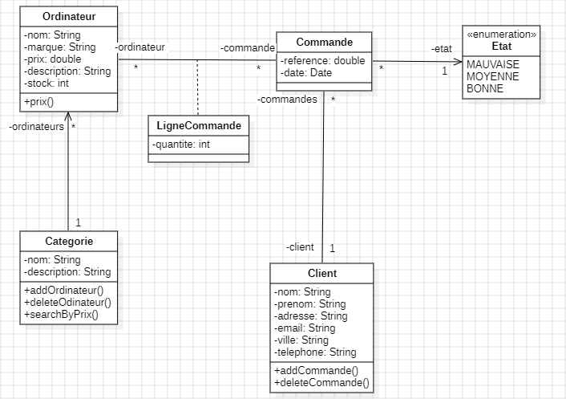

## Class Diagram

******

# Classe Ordinateur

## Français

La classe `Ordinateur` représente un ordinateur avec divers attributs comme le nom, la marque, le prix, une description et la quantité en stock. Elle propose des méthodes pour accéder et modifier les valeurs de chaque attribut, ainsi qu'une méthode pour afficher l'ordinateur sous forme de chaîne de caractères.

### Attributs
- `id` (long) : Identifiant unique de l'ordinateur, généré automatiquement par un nombre aléatoire.
- `nom` (String) : Nom du modèle de l'ordinateur.
- `marque` (String) : Marque de l'ordinateur.
- `prix` (double) : Prix de l'ordinateur.
- `description` (String) : Description de l'ordinateur.
- `stock` (int) : Quantité en stock de l'ordinateur.

### Constructeurs
- `Ordinateur()` : Constructeur par défaut, qui initialise un ordinateur sans définir ses attributs.
- `Ordinateur(String nom, String marque, double prix, String description, int stock)` : Crée une nouvelle instance d'`Ordinateur` en initialisant les attributs avec les valeurs fournies et en générant un identifiant unique.

### Méthodes
- `long getId()` : Retourne l'identifiant de l'ordinateur.
- `void setId(long id)` : Définit l'identifiant de l'ordinateur.
- `String getNom()` : Retourne le nom du modèle de l'ordinateur.
- `void setNom(String nom)` : Définit le nom du modèle de l'ordinateur.
- `String getMarque()` : Retourne la marque de l'ordinateur.
- `void setMarque(String marque)` : Définit la marque de l'ordinateur.
- `double getPrix()` : Retourne le prix de l'ordinateur.
- `void setPrix(double prix)` : Définit le prix de l'ordinateur.
- `String getDescription()` : Retourne la description de l'ordinateur.
- `void setDescription(String description)` : Définit la description de l'ordinateur.
- `int getStock()` : Retourne la quantité en stock de l'ordinateur.
- `void setStock(int stock)` : Définit la quantité en stock de l'ordinateur.
- `String toString()` : Retourne une représentation de l'ordinateur sous forme de chaîne de caractères, contenant les valeurs de tous les attributs.

---

## English

The `Ordinateur` class represents a computer with various attributes like name, brand, price, description, and stock quantity. It provides methods to access and modify each attribute, as well as a method to display the computer as a string.

### Attributes
- `id` (long): Unique identifier for the computer, generated automatically with a random number.
- `nom` (String): Model name of the computer.
- `marque` (String): Brand of the computer.
- `prix` (double): Price of the computer.
- `description` (String): Description of the computer.
- `stock` (int): Stock quantity of the computer.

### Constructors
- `Ordinateur()`: Default constructor, which initializes a computer without defining its attributes.
- `Ordinateur(String nom, String marque, double prix, String description, int stock)`: Creates a new `Ordinateur` instance, initializing the attributes with the provided values and generating a unique identifier.

### Methods
- `long getId()`: Returns the computer's unique identifier.
- `void setId(long id)`: Sets the computer's unique identifier.
- `String getNom()`: Returns the computer model's name.
- `void setNom(String nom)`: Sets the computer model's name.
- `String getMarque()`: Returns the computer brand.
- `void setMarque(String marque)`: Sets the computer brand.
- `double getPrix()`: Returns the computer's price.
- `void setPrix(double prix)`: Sets the computer's price.
- `String getDescription()`: Returns the computer's description.
- `void setDescription(String description)`: Sets the computer's description.
- `int getStock()`: Returns the available stock quantity of the computer.
- `void setStock(int stock)`: Sets the available stock quantity of the computer.
- `String toString()`: Returns a string representation of the computer, containing all attribute values.

---

# Classe Categorie

## Français

La classe `Categorie` représente une catégorie d'ordinateurs avec un identifiant unique, un nom, une description, et une liste d'objets `Ordinateur`. Elle permet d'ajouter, de supprimer et de rechercher des ordinateurs en fonction de leur prix.

### Attributs
- `id` (long) : Identifiant unique de la catégorie, généré automatiquement par un nombre aléatoire.
- `nom` (String) : Nom de la catégorie.
- `description` (String) : Description de la catégorie.
- `ordinateurList` (List<Ordinateur>) : Liste des ordinateurs appartenant à cette catégorie.

### Constructeurs
- `Categorie()` : Constructeur par défaut, qui initialise une catégorie sans définir ses attributs.
- `Categorie(String nom, String description)` : Crée une nouvelle instance de `Categorie` avec un identifiant unique, un nom et une description.

### Méthodes
- `void ajouterOrdinateur(Ordinateur ordinateur)` : Ajoute un objet `Ordinateur` à la liste `ordinateurList` s'il n'est pas déjà présent.
- `void supprimerOrdinateur(Ordinateur ordinateur)` : Supprime un objet `Ordinateur` de la liste `ordinateurList`.
- `List<Ordinateur> rechercherOrdinateur(double prix)` : Retourne une liste d'ordinateurs dont le prix est égal au prix spécifié.
- `long getId()` : Retourne l'identifiant de la catégorie.
- `void setId(long id)` : Définit l'identifiant de la catégorie.
- `String getNom()` : Retourne le nom de la catégorie.
- `void setNom(String nom)` : Définit le nom de la catégorie.
- `String getDescription()` : Retourne la description de la catégorie.
- `void setDescription(String description)` : Définit la description de la catégorie.
- `List<Ordinateur> getOrdinateurList()` : Retourne la liste d'ordinateurs de la catégorie.
- `void setOrdinateurList(List<Ordinateur> ordinateurList)` : Définit la liste d'ordinateurs de la catégorie.
- `String toString()` : Retourne une représentation de la catégorie sous forme de chaîne de caractères, contenant les valeurs de tous les attributs.

---

## English

The `Categorie` class represents a category of computers with a unique identifier, name, description, and a list of `Ordinateur` objects. It allows adding, removing, and searching for computers based on their price.

### Attributes
- `id` (long): Unique identifier for the category, generated automatically with a random number.
- `nom` (String): Name of the category.
- `description` (String): Description of the category.
- `ordinateurList` (List<Ordinateur>): List of computers belonging to this category.

### Constructors
- `Categorie()`: Default constructor, which initializes a category without defining its attributes.
- `Categorie(String nom, String description)`: Creates a new `Categorie` instance with a unique identifier, a name, and a description.

### Methods
- `void ajouterOrdinateur(Ordinateur ordinateur)`: Adds an `Ordinateur` object to `ordinateurList` if it's not already present.
- `void supprimerOrdinateur(Ordinateur ordinateur)`: Removes an `Ordinateur` object from `ordinateurList`.
- `List<Ordinateur> rechercherOrdinateur(double prix)`: Returns a list of computers whose price matches the specified value.
- `long getId()`: Returns the unique identifier of the category.
- `void setId(long id)`: Sets the unique identifier of the category.
- `String getNom()`: Returns the category name.
- `void setNom(String nom)`: Sets the category name.
- `String getDescription()`: Returns the category description.
- `void setDescription(String description)`: Sets the category description.
- `List<Ordinateur> getOrdinateurList()`: Returns the list of computers in the category.
- `void setOrdinateurList(List<Ordinateur> ordinateurList)`: Sets the list of computers in the category.
- `String toString()`: Returns a string representation of the category, including all attribute values.

---

# Classe Commande

## Français

La classe `Commande` représente une commande avec un identifiant unique, une référence, une date, un état, et un client associé. Elle offre des méthodes pour accéder et modifier les valeurs de chaque attribut.

### Attributs
- `id` (long) : Identifiant unique de la commande, généré automatiquement par un nombre aléatoire.
- `reference` (String) : Référence unique de la commande.
- `date` (LocalDate) : Date de la commande.
- `etat` (Etat) : État de la commande, représenté par une instance de l'énumération `Etat`.
- `client` (Client) : Client associé à la commande.

### Constructeurs
- `Commande()` : Constructeur par défaut, qui initialise une commande sans définir ses attributs.
- `Commande(String reference, Client client, LocalDate date, Etat etat)` : Crée une nouvelle instance de `Commande` en initialisant les attributs avec les valeurs fournies et en générant un identifiant unique.

### Méthodes
- `long getId()` : Retourne l'identifiant de la commande.
- `void setId(long id)` : Définit l'identifiant de la commande.
- `String getReference()` : Retourne la référence de la commande.
- `void setReference(String reference)` : Définit la référence de la commande.
- `LocalDate getDate()` : Retourne la date de la commande.
- `void setDate(LocalDate date)` : Définit la date de la commande.
- `Etat getEtat()` : Retourne l'état de la commande.
- `void setEtat(Etat etat)` : Définit l'état de la commande.
- `Client getClient()` : Retourne le client associé à la commande.
- `void setClient(Client client)` : Définit le client associé à la commande.
- `String toString()` : Retourne une représentation de la commande sous forme de chaîne de caractères, contenant les valeurs de tous les attributs, incluant le nom et le prénom du client.

---

## English

The `Commande` class represents an order with a unique identifier, reference, date, status, and an associated client. It provides methods to access and modify each attribute.

### Attributes
- `id` (long): Unique identifier for the order, generated automatically with a random number.
- `reference` (String): Unique reference of the order.
- `date` (LocalDate): Date of the order.
- `etat` (Etat): Status of the order, represented by an instance of the `Etat` enumeration.
- `client` (Client): Client associated with the order.

### Constructors
- `Commande()`: Default constructor, which initializes an order without defining its attributes.
- `Commande(String reference, Client client, LocalDate date, Etat etat)`: Creates a new `Commande` instance, initializing the attributes with the provided values and generating a unique identifier.

### Methods
- `long getId()`: Returns the unique identifier of the order.
- `void setId(long id)`: Sets the unique identifier of the order.
- `String getReference()`: Returns the reference of the order.
- `void setReference(String reference)`: Sets the reference of the order.
- `LocalDate getDate()`: Returns the date of the order.
- `void setDate(LocalDate date)`: Sets the date of the order.
- `Etat getEtat()`: Returns the status of the order.
- `void setEtat(Etat etat)`: Sets the status of the order.
- `Client getClient()`: Returns the client associated with the order.
- `void setClient(Client client)`: Sets the client associated with the order.
- `String toString()`: Returns a string representation of the order, containing all attribute values, including the client's first and last names.

---

# Énumération Etat

## Français

L'énumération `Etat` représente les différents états possibles d'une commande. Elle contient trois constantes qui reflètent la qualité de la commande.

### Constantes
- `MAUVAISE` : Représente un état de mauvaise qualité pour la commande.
- `MOYENNE` : Représente un état de qualité moyenne pour la commande.
- `BONNE` : Représente un état de bonne qualité pour la commande.

---

## English

The `Etat` enumeration represents the different possible statuses of an order. It contains three constants that reflect the quality of the order.

### Constants
- `MAUVAISE`: Represents a poor quality status for the order.
- `MOYENNE`: Represents an average quality status for the order.
- `BONNE`: Represents a good quality status for the order.

---

# Classe LigneCommande

## Français

La classe `LigneCommande` représente une ligne de commande associée à une commande spécifique, indiquant la quantité d'un ordinateur commandé. Elle contient des attributs pour gérer l'identifiant de la ligne de commande, la quantité, la commande à laquelle elle appartient et l'ordinateur concerné.

### Attributs
- `id` (long) : Identifiant unique de la ligne de commande, généré automatiquement par un nombre aléatoire.
- `quantite` (int) : Quantité d'ordinateurs dans cette ligne de commande.
- `commande` (Commande) : La commande à laquelle cette ligne appartient.
- `ordinateur` (Ordinateur) : L'ordinateur qui est commandé dans cette ligne.

### Constructeurs
- `LigneCommande()` : Constructeur par défaut, qui initialise une ligne de commande sans définir ses attributs.
- `LigneCommande(int quantite, Commande commande, Ordinateur ordinateur)` : Crée une nouvelle instance de `LigneCommande` en initialisant les attributs avec les valeurs fournies et en générant un identifiant unique.

### Méthodes
- `long getId()` : Retourne l'identifiant de la ligne de commande.
- `void setId(long id)` : Définit l'identifiant de la ligne de commande.
- `int getQuantite()` : Retourne la quantité d'ordinateurs dans la ligne de commande.
- `void setQuantite(int quantite)` : Définit la quantité d'ordinateurs dans la ligne de commande.
- `Commande getCommande()` : Retourne la commande associée à la ligne.
- `void setCommande(Commande commande)` : Définit la commande associée à la ligne.
- `Ordinateur getOrdinateur()` : Retourne l'ordinateur associé à la ligne de commande.
- `void setOrdinateur(Ordinateur ordinateur)` : Définit l'ordinateur associé à la ligne de commande.
- `String toString()` : Retourne une représentation de la ligne de commande sous forme de chaîne de caractères, contenant les valeurs de tous les attributs, incluant les détails de la commande et de l'ordinateur.

---

## English

The `LigneCommande` class represents a line item in an order, indicating the quantity of a specific computer ordered. It contains attributes to manage the unique identifier of the line item, the quantity, the associated order, and the computer involved.

### Attributes
- `id` (long): Unique identifier for the line item, generated automatically with a random number.
- `quantite` (int): Quantity of computers in this line item.
- `commande` (Commande): The order to which this line belongs.
- `ordinateur` (Ordinateur): The computer being ordered in this line item.

### Constructors
- `LigneCommande()`: Default constructor, which initializes a line item without defining its attributes.
- `LigneCommande(int quantite, Commande commande, Ordinateur ordinateur)`: Creates a new `LigneCommande` instance, initializing the attributes with the provided values and generating a unique identifier.

### Methods
- `long getId()`: Returns the unique identifier of the line item.
- `void setId(long id)`: Sets the unique identifier of the line item.
- `int getQuantite()`: Returns the quantity of computers in the line item.
- `void setQuantite(int quantite)`: Sets the quantity of computers in the line item.
- `Commande getCommande()`: Returns the order associated with the line item.
- `void setCommande(Commande commande)`: Sets the order associated with the line item.
- `Ordinateur getOrdinateur()`: Returns the computer associated with the line item.
- `void setOrdinateur(Ordinateur ordinateur)`: Sets the computer associated with the line item.
- `String toString()`: Returns a string representation of the line item, including all attribute values, as well as the details of the order and the computer.

---

# Classe Main

## Français

La classe `Main` contient la méthode principale de l'application. Elle sert à exécuter le programme, en créant des instances des différentes classes (`Ordinateur`, `Categorie`, `Client`, `Commande`, et `LigneCommande`) et en les reliant entre elles. C'est ici que l'ensemble des objets est initialisé et manipulé.

### Méthode
- `public static void main(String[] args)`: Point d'entrée de l'application.
    - Crée plusieurs objets `Ordinateur`.
    - Crée une `Categorie` et y ajoute les ordinateurs créés.
    - Crée un `Client`.
    - Crée une `Commande` associée au client.
    - Crée plusieurs `LigneCommande` associées à la commande, chacune contenant un ordinateur et une quantité.
    - Imprime les détails de la commande à l'aide de la méthode `toString()`.

### Exécution
Lors de l'exécution de la méthode `main`, les objets sont instanciés et leurs relations établies. La sortie affichera les informations de la commande créée, incluant les détails du client et des ordinateurs commandés.

******

---

## English

The `Main` class contains the application's main method. It serves to execute the program by creating instances of various classes (`Ordinateur`, `Categorie`, `Client`, `Commande`, and `LigneCommande`) and linking them together. This is where the entire object setup occurs.

### Method
- `public static void main(String[] args)`: The entry point of the application.
    - Creates several `Ordinateur` objects.
    - Creates a `Categorie` and adds the created computers to it.
    - Creates a `Client`.
    - Creates a `Commande` associated with the client.
    - Creates multiple `LigneCommande` items associated with the order, each containing a computer and a quantity.
    - Prints the details of the created order using the `toString()` method.

### Execution
When the `main` method is executed, the objects are instantiated, and their relationships are established. The output will display the information of the created order, including the details of the client and the ordered computers.

******

