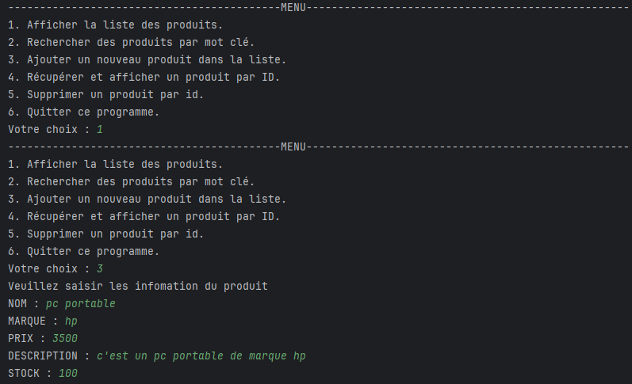
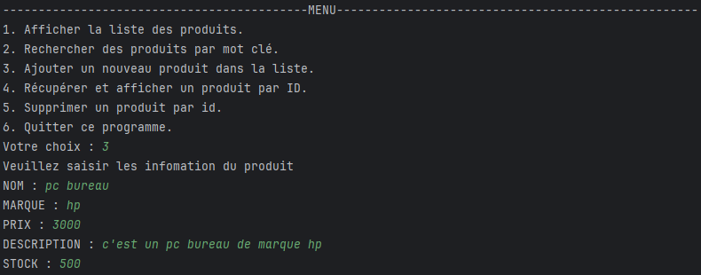
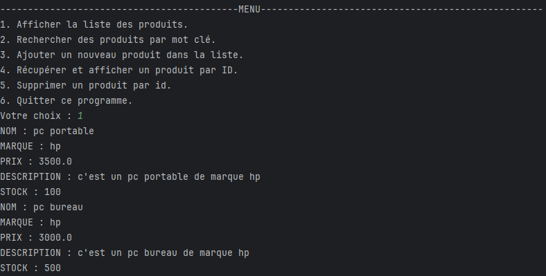
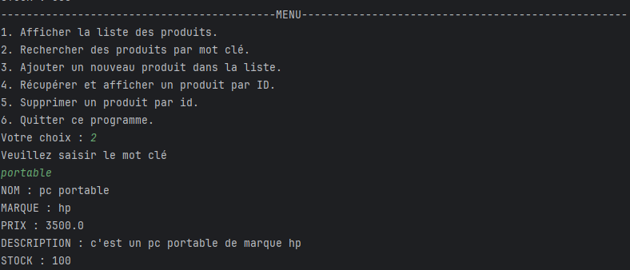
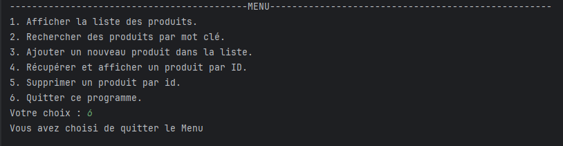

# Classe Produit

## Français

La classe `Produit` représente un produit avec des attributs de base tels que le nom, la marque, le prix, la description et le stock disponible. Elle inclut également des méthodes pour accéder et modifier ces attributs.

### Attributs
- `id` (long) : Identifiant unique du produit, généré aléatoirement.
- `nom` (String) : Nom du produit.
- `marque` (String) : Marque du produit.
- `prix` (double) : Prix du produit.
- `description` (String) : Description du produit.
- `stock` (int) : Quantité de produit disponible en stock.

### Constructeurs
- `Produit()` : Constructeur par défaut qui initialise un produit sans paramètres.
- `Produit(String nom, String marque, double prix, String description, int stock)` : Crée une nouvelle instance de `Produit` avec des attributs spécifiés et un identifiant généré aléatoirement.

### Méthodes
- `long getId()` : Retourne l'identifiant du produit.
- `void setId(long id)` : Définit l'identifiant du produit.
- `String getNom()` : Retourne le nom du produit.
- `void setNom(String nom)` : Définit le nom du produit.
- `String getMarque()` : Retourne la marque du produit.
- `void setMarque(String marque)` : Définit la marque du produit.
- `double getPrix()` : Retourne le prix du produit.
- `void setPrix(double prix)` : Définit le prix du produit.
- `String getDescription()` : Retourne la description du produit.
- `void setDescription(String description)` : Définit la description du produit.
- `int getStock()` : Retourne la quantité de produit disponible.
- `void setStock(int stock)` : Définit la quantité de produit disponible.

---

## English

The `Produit` class represents a product with basic attributes such as name, brand, price, description, and available stock. It also includes methods to access and modify these attributes.

### Attributes
- `id` (long): Unique identifier for the product, generated randomly.
- `nom` (String): Name of the product.
- `marque` (String): Brand of the product.
- `prix` (double): Price of the product.
- `description` (String): Description of the product.
- `stock` (int): Quantity of the product available in stock.

### Constructors
- `Produit()`: Default constructor that initializes a product without parameters.
- `Produit(String nom, String marque, double prix, String description, int stock)`: Creates a new `Produit` instance with specified attributes and a randomly generated identifier.

### Methods
- `long getId()`: Returns the product's identifier.
- `void setId(long id)`: Sets the product's identifier.
- `String getNom()`: Returns the product's name.
- `void setNom(String nom)`: Sets the product's name.
- `String getMarque()`: Returns the product's brand.
- `void setMarque(String marque)`: Sets the product's brand.
- `double getPrix()`: Returns the product's price.
- `void setPrix(double prix)`: Sets the product's price.
- `String getDescription()`: Returns the product's description.
- `void setDescription(String description)`: Sets the product's description.
- `int getStock()`: Returns the available quantity of the product.
- `void setStock(int stock)`: Sets the available quantity of the product.

# Interface IMetier

## Français

L'interface `IMetier` définit les opérations de gestion des produits. Elle spécifie les méthodes à implémenter pour manipuler des objets de type `Produit`.

### Méthodes
- `Produit add(Produit p)` : Ajoute un produit et retourne le produit ajouté.
- `List<Produit> getAll()` : Retourne une liste de tous les produits.
- `List<Produit> findByNom(String motCle)` : Recherche des produits par leur nom en utilisant un mot clé et retourne une liste de produits correspondants.
- `Produit findById(long id)` : Recherche un produit par son identifiant et retourne le produit trouvé.
- `void delete(long id)` : Supprime un produit par son identifiant.

---

## English

The `IMetier` interface defines the operations for managing products. It specifies the methods to be implemented for handling `Produit` objects.

### Methods
- `Produit add(Produit p)`: Adds a product and returns the added product.
- `List<Produit> getAll()`: Returns a list of all products.
- `List<Produit> findByNom(String motCle)`: Searches for products by name using a keyword and returns a list of matching products.
- `Produit findById(long id)`: Searches for a product by its identifier and returns the found product.
- `void delete(long id)`: Deletes a product by its identifier.

# Classe MetierProduitImpl

## Français

La classe `MetierProduitImpl` implémente l'interface `IMetier` et fournit des méthodes concrètes pour gérer une liste de produits. Elle permet d'ajouter, de récupérer, de rechercher et de supprimer des produits.

### Attributs
- `List<Produit> listProduit` : Liste contenant les produits.

### Constructeur
- `MetierProduitImpl(List<Produit> listProduit)` : Crée une instance de `MetierProduitImpl` en initialisant la liste de produits.

### Méthodes
- `Produit add(Produit p)` : Ajoute un produit à la liste et retourne le produit ajouté.
- `List<Produit> getAll()` : Retourne la liste de tous les produits.
- `List<Produit> findByNom(String motCle)` : Recherche les produits dont le nom contient le mot clé donné et retourne une liste des produits correspondants.
- `Produit findById(long id)` : Recherche un produit par son identifiant et retourne le produit trouvé ou `null` s'il n'existe pas.
- `void delete(long id)` : Supprime un produit de la liste par son identifiant.

---

## English

The `MetierProduitImpl` class implements the `IMetier` interface and provides concrete methods for managing a list of products. It allows adding, retrieving, searching, and deleting products.

### Attributes
- `List<Produit> listProduit`: A list containing the products.

### Constructor
- `MetierProduitImpl(List<Produit> listProduit)`: Creates an instance of `MetierProduitImpl`, initializing the list of products.

### Methods
- `Produit add(Produit p)`: Adds a product to the list and returns the added product.
- `List<Produit> getAll()`: Returns the list of all products.
- `List<Produit> findByNom(String motCle)`: Searches for products whose name contains the given keyword and returns a list of matching products.
- `Produit findById(long id)`: Searches for a product by its identifier and returns the found product or `null` if it does not exist.
- `void delete(long id)`: Removes a product from the list by its identifier.

# Classe Application

## Français

La classe `Application` fournit une interface utilisateur simple en ligne de commande pour gérer une liste de produits. Elle permet à l'utilisateur d'ajouter, de rechercher, d'afficher et de supprimer des produits.

### Méthodes

- `Produit saisieProduit()`:
    - Demande à l'utilisateur de saisir les informations d'un produit (nom, marque, prix, description et stock) et retourne un objet `Produit` avec ces informations.

- `void afficherProduit(Produit produit)`:
    - Affiche les détails d'un produit donné dans la console.

- `void Main()`:
    - Méthode principale qui gère le menu de l'application. Elle présente plusieurs options à l'utilisateur et exécute les actions correspondantes :
        - **1** : Afficher la liste des produits.
        - **2** : Rechercher des produits par mot clé.
        - **3** : Ajouter un nouveau produit à la liste.
        - **4** : Récupérer et afficher un produit par ID.
        - **5** : Supprimer un produit par ID.
        - **6** : Quitter le programme.

### Utilisation

1. Lancer l'application.
2. Suivre les instructions du menu pour interagir avec la liste des produits.
3. Saisir les informations demandées lorsque cela est nécessaire.

---

## English

The `Application` class provides a simple command-line user interface for managing a list of products. It allows the user to add, search, display, and delete products.

### Methods

- `Produit saisieProduit()`:
    - Prompts the user to enter the information for a product (name, brand, price, description, and stock) and returns a `Produit` object with this information.

- `void afficherProduit(Produit produit)`:
    - Displays the details of a given product to the console.

- `void Main()`:
    - The main method that manages the application's menu. It presents several options to the user and executes the corresponding actions:
        - **1**: Display the list of products.
        - **2**: Search for products by keyword.
        - **3**: Add a new product to the list.
        - **4**: Retrieve and display a product by ID.
        - **5**: Delete a product by ID.
        - **6**: Exit the program.

### Usage

1. Run the application.
2. Follow the menu instructions to interact with the product list.
3. Enter the requested information when necessary.

# Classe Main

## Français

La classe `Main` contient la méthode principale de l'application. Elle est responsable du démarrage de l'application et de l'exécution de la méthode `Main` de la classe `Application`, qui gère l'interface utilisateur et les interactions avec les produits.

### Méthodes

- `public static void main(String[] args)`:
    - C'est la méthode principale qui est exécutée lors du démarrage de l'application. Elle appelle la méthode `Main()` de la classe `Application` pour initier l'interface utilisateur.

### Utilisation

1. Compilez l'application.
2. Exécutez la classe `Main` pour démarrer l'application.
3. Suivez les instructions affichées dans le menu de l'application.

***
***
***
***
***

---

## English

The `Main` class contains the main method of the application. It is responsible for starting the application and executing the `Main` method of the `Application` class, which manages the user interface and interactions with the products.

### Methods

- `public static void main(String[] args)`:
    - This is the main method that is executed when the application starts. It calls the `Main()` method of the `Application` class to initiate the user interface.

### Usage

1. Compile the application.
2. Run the `Main` class to start the application.
3. Follow the instructions displayed in the application menu.

***
***
***
***
***
